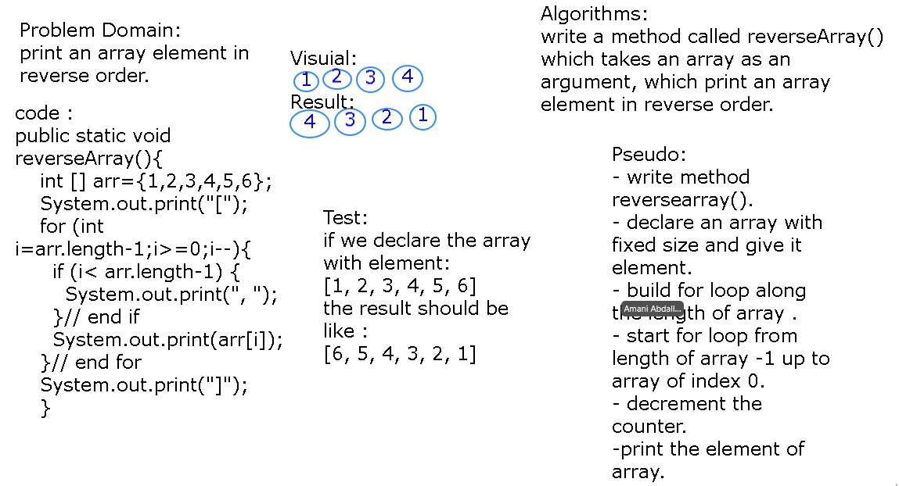

# Table of Contents:

|Code Challenge Number|Title            |Link        |
|---------            |--------         |------------|
|CC :1                |Reverse an Array |[Reverse Array](app/src/main/java/challenges/ArrayReverse.java)|

<!-- [Reverse Array](app/src/main/java/challenges/ArrayReverse.java) -->

# CC1: Reverse an Array

# Reverse an Array
we did a function called reverseArray which takes an array as an argument,and return an array with elements in reversed order Without use the built-in methods.  

## Challenge
how to print element of the array in reverse order and if the user input empty array.

## Approach & Efficiency
start from array length up to array of index zero and decrement counter instead of increment .

## Solution
i wrote a method named it reverseArray and using for loop i looped every element in array starting the length of array-1 up to index of zero to print tle element in reverse order .