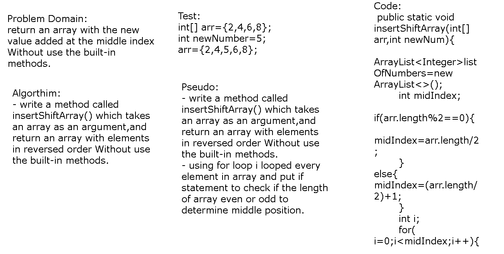

# CC2: Array-Shift.

# Array-Shift
we did a function called insertShiftArray which takes in an array and the value to be added,and return an array with the new value added at the middle index Without use the built-in methods. 
 

## Challenge
how to put value of element of the array in the middle index of array .

## Approach & Efficiency
for loops and if statement and use array list .

## Solution
i wrote a method named it insertShiftArray and using for loop i looped every element in array and put if statement to check if the length of array even or odd to determine middle position  .